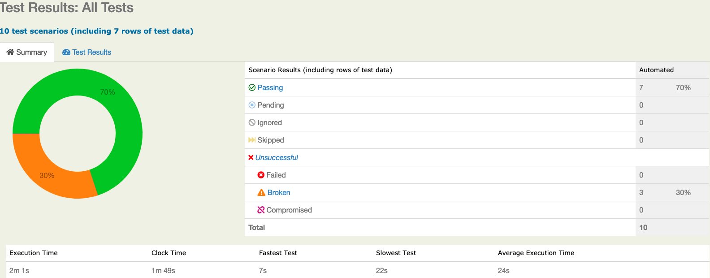
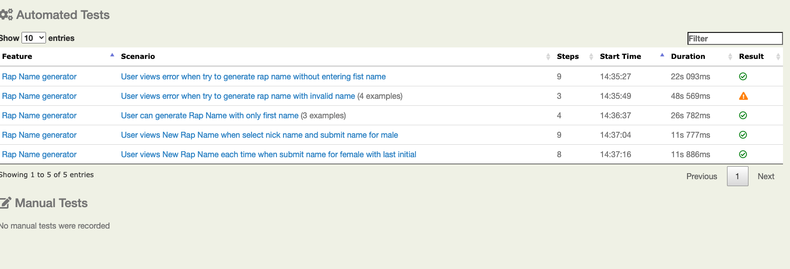
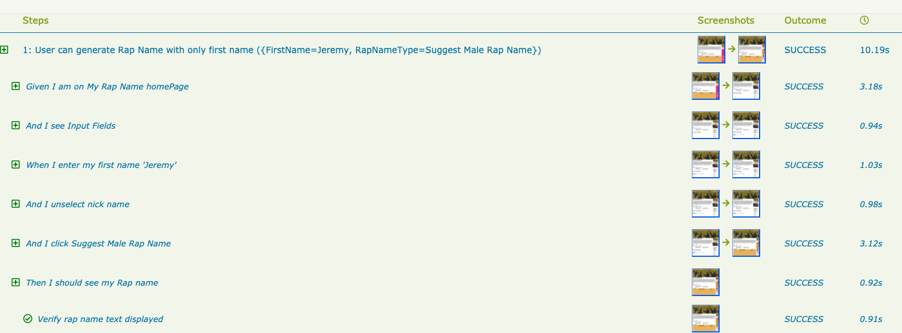
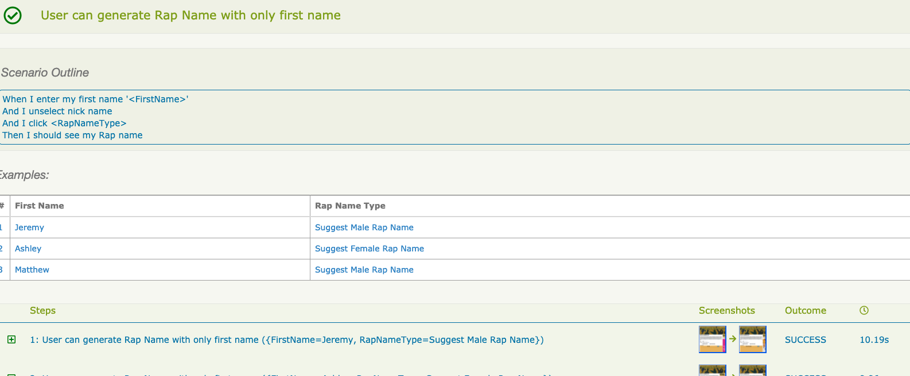

# qa-interview-dhaval
Homepage='http://www.myrapname.com/'

### Tests
Write an automated test to validate each of the following:
1. The input fields exist
2. A negative scenario using the input fields
3. Input data into the fields
4. Submit a name for male with a nickname and validate that a new name has been prepended to the list
5. Submit twice for a female with a last initial and validate that a new name has been prepended to the list

### Solution:
  1. Gradle IntelliJ Project
  2. Serenity BDD Framework
  
### Serenity Report Screenshots:

